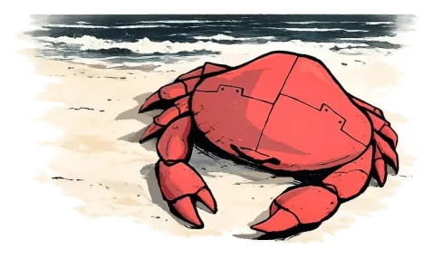

# E2E test: sidebar reporter files a PR

Automated end-to-end check of the bug reporter. Steps: open modal, attach crab, submit. Expected: this exact PR. This PR will be closed by the same automation.

## Context

| | |
|---|---|
| Reporter | Andre Boufama (ab3233@cornell.edu) |
| Page | #/ |
| Viewport | 1440x900 |
| Browser | Mozilla/5.0 (Macintosh; Intel Mac OS X 10_15_7) AppleWebKit/537.36 (KHTML, like Gecko) HeadlessChrome/151.0.7922.34 Safari/537.36 |
| Filed | 2026-08-21T19:15:35.028Z |

## Screenshots

